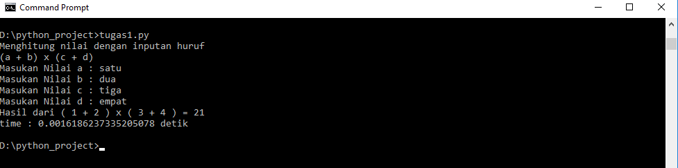

## Latar Belakang Masalah :
1. Kecerdasan Buatan

## Kecerdasan Buatan
Kecerdasan buatan merupakan kecerdasan yang diciptakan dan dimasukkan ke dalam suatu mesin (komputer) agar dapat melakukan pekerjaan seperti yang dapat dilakukan manusia. Kecerdasan buatan ini juga dapat membuat dan merekayasa mesin (komputer) agar dapat melakukan pekerjaan yang mampu cepat dan tepat. Cepat artinya melakukan segala sesuatu dengan waktu yang singkat dan tepat artinya melakukan segala sesuatu dengan benar.

Dibawah ini terdapat contoh hasil kode aritmatika perhitungan dengan menggunakan bahasa python yang diinput dengan huruf dan outputnya hasil dan durasi waktu pemrosesan.

## Kesimpulan
Kesimpulanny adalah, Kecerdasan Buatan sangat kita butuhkan dalam kehidupan yang modern saat ini, kita dapat menciptakan hal yang baru yang lebih cepat dan tepat sesuai target yang kita inginkan.

## Saran
Sebaiknya selalu diadakan praktik setiap minggu agar mahasiswa dapat lebih mengetahui tentang materi kecerdasan buatan.
 
* Nama : Aldy Muldani
* NPM : 1144123
* Kelas : 3C
* Prodi : D4 Teknik Informatika
* Kampus : Politeknik Pos Indonesia